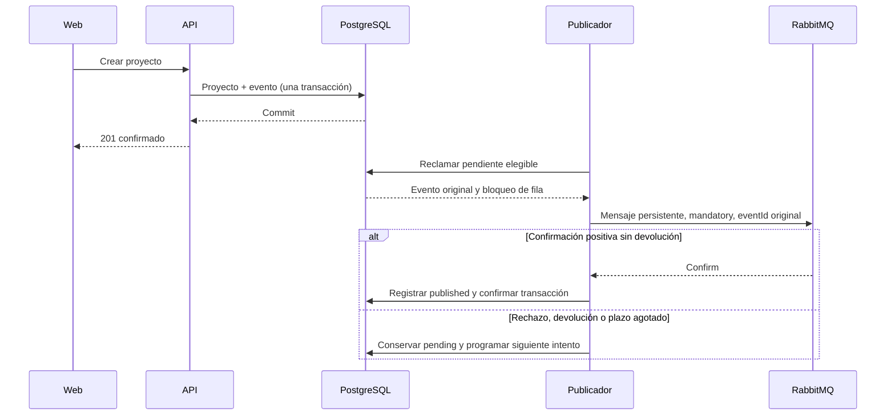

# Publicación de eventos y recuperación

Contrato aprobado: [publish_outbox](../features/publish_outbox.feature). Este documento explica las garantías del diseño; el estado de implementación y los resultados ejecutados están en feature_list.json y progress/.

## Qué significa cada estado

| Estado | Significado | Próximo comportamiento |
| --- | --- | --- |
| pending | No existe confirmación persistida de publicación satisfactoria. Puede que el broker ya haya recibido una copia si hubo una caída. | Reintentar cuando llegue next_attempt_at. |
| published | El broker confirmó aceptación/ruta y PostgreSQL confirmó el resultado. | Conservar registro; no reenviar automáticamente. |
| blocked | El tipo, versión o contenido no satisface el contrato del evento. | Conservar para inspección; no enviar ni borrar automáticamente. |

El éxito del POST significa que proyecto y evento están guardados, independientemente de la disponibilidad de RabbitMQ. El éxito del publicador significa aceptación por el broker, no procesamiento por un consumidor. Este corte no crea consumidores ni conectores.

## Caída entre aceptación y commit

Si RabbitMQ acepta el mensaje y PostgreSQL no llega a confirmar published, el evento continúa pendiente. El siguiente intento puede crear una segunda copia. Todas conservan eventId y payload; los futuros consumidores deberán reconocer duplicados por identidad. No se promete entrega exactamente una vez ni un máximo universal de copias.

El contador attempts refleja resultados terminados y registrados, incluidos éxitos y fallos. No puede contar con exactitud envíos cuyo resultado se perdió en una caída. El estado PostgreSQL y el mensaje no participan en una transacción distribuida.

## Trabajo acotado y recuperación

Cada ciclo procesa hasta 20 eventos distintos. Las filas reclamadas por otra réplica se omiten. Las transacciones son por evento; no se mantiene un bloqueo para todo el lote. Un fallo conserva el payload original y retrasa el siguiente intento 1, 2, 4, 8, 16, 32 y luego 60 segundos como máximo, sin descartar eventos por alcanzar un número de intentos.

La espera de confirmación es de 5 segundos. Conexión, operaciones del canal y limpieza requieren límites propios; el presupuesto total de un ciclo no equivale a 5 segundos. Los diagnósticos del publicador usan identidad de evento, resultado, intento y códigos; no deben incluir el contenido privado ni secretos.

## Datos y operación

PostgreSQL y RabbitMQ necesitan sus volúmenes. La cola quorum durable de un nodo conserva mensajes al reiniciar con los mismos datos; no constituye alta disponibilidad ni garantiza recuperación tras perder el disco. Una topología incompatible se reporta sin eliminarla ni sustituirla automáticamente.

La ejecución local opcional se documenta en el README del repositorio. El despliegue al servidor sigue el repositorio de infraestructura y requiere integrar capacidad, TLS, secretos y respaldo de ambos almacenes. No se ha desplegado este servicio en producción por añadir la configuración local.

## Eventos incorporados

| Evento | Ruta | Cola quorum durable |
| --- | --- | --- |
| ProjectCreated.v1 | project.created.v1 | organization.project-created.v1 |
| ProjectUpdated.v1 | project.updated.v1 | organization.project-updated.v1 |
| ProjectStatusChanged.v1 | project.status-changed.v1 | organization.project-status-changed.v1 |
| TaskCreated.v1 | task.created.v1 | organization.task-created.v1 |

TaskCreated conserva aggregateId del proyecto y taskId de la tarea hija. Su payload incluye título, pero excluye criterio y estimación. Crear una tarea confirma tarea y evento en la misma transacción, sin cambiar la representación o versión del proyecto. El estado final de validación se registra en create_task dentro del roadmap.

Compartir aggregateId no garantiza orden de publicación por proyecto: las filas se procesan de forma independiente y pueden reintentarse. Un consumidor futuro deberá atender a identidad y semántica del evento, sin deducir una secuencia causal de su orden de llegada.
