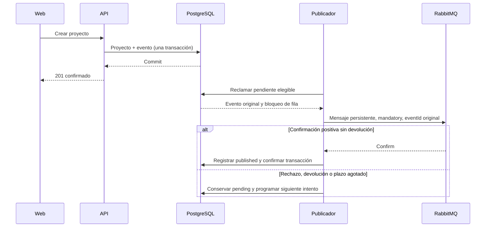

# Publicación de eventos y recuperación

Contrato aprobado: [publish_outbox](../features/publish_outbox.feature). Este documento explica las garantías del diseño; el estado de implementación y los resultados ejecutados están en feature_list.json y progress/.

## Qué significa cada estado

| Estado | Significado | Próximo comportamiento |
| --- | --- | --- |
| pending | No existe confirmación persistida de publicación satisfactoria. Puede que el broker ya haya recibido una copia si hubo una caída. | Reintentar cuando llegue next_attempt_at. |
| published | El broker confirmó aceptación/ruta y PostgreSQL confirmó el resultado. | Conservar registro; no reenviar automáticamente. |
| blocked | El tipo, versión o contenido no satisface el contrato del evento. | Conservar para inspección; no enviar ni borrar automáticamente. |

El éxito del POST significa que proyecto y evento están guardados, independientemente de la disponibilidad de RabbitMQ. El éxito del publicador significa aceptación por el broker, no procesamiento por un consumidor. Este corte no crea consumidores ni conectores.

## Caída entre aceptación y commit

Si RabbitMQ acepta el mensaje y PostgreSQL no llega a confirmar published, el evento continúa pendiente. El siguiente intento puede crear una segunda copia. Todas conservan eventId y payload; los futuros consumidores deberán reconocer duplicados por identidad. No se promete entrega exactamente una vez ni un máximo universal de copias.

El contador attempts refleja resultados terminados y registrados, incluidos éxitos y fallos. No puede contar con exactitud envíos cuyo resultado se perdió en una caída. El estado PostgreSQL y el mensaje no participan en una transacción distribuida.

## Trabajo acotado y recuperación

Cada ciclo procesa hasta 20 eventos distintos. Las filas reclamadas por otra réplica se omiten. Las transacciones son por evento; no se mantiene un bloqueo para todo el lote. Un fallo conserva el payload original y retrasa el siguiente intento 1, 2, 4, 8, 16, 32 y luego 60 segundos como máximo, sin descartar eventos por alcanzar un número de intentos.

La espera de confirmación es de 5 segundos. Conexión, operaciones del canal y limpieza requieren límites propios; el presupuesto total de un ciclo no equivale a 5 segundos. Los diagnósticos del publicador usan identidad de evento, resultado, intento y códigos; no deben incluir el contenido privado ni secretos.

## Datos y operación

PostgreSQL y RabbitMQ necesitan sus volúmenes. La cola quorum durable de un nodo conserva mensajes al reiniciar con los mismos datos; no constituye alta disponibilidad ni garantiza recuperación tras perder el disco. Una topología incompatible se reporta sin eliminarla ni sustituirla automáticamente.

La ejecución local opcional se documenta en el README del repositorio. El despliegue al servidor sigue el repositorio de infraestructura y requiere integrar capacidad, TLS, secretos y respaldo de ambos almacenes. No se ha desplegado este servicio en producción por añadir la configuración local.

## Eventos incorporados

| Evento | Ruta | Cola quorum durable |
| --- | --- | --- |
| ProjectCreated.v1 | project.created.v1 | organization.project-created.v1 |
| ProjectUpdated.v1 | project.updated.v1 | organization.project-updated.v1 |
| ProjectStatusChanged.v1 | project.status-changed.v1 | organization.project-status-changed.v1 |
| TaskCreated.v1 | task.created.v1 | organization.task-created.v1 |
| SubtaskCreated.v1 | subtask.created.v1 | organization.subtask-created.v1 |
| TaskStatusChanged.v1 | task.status-changed.v1 | organization.task-status-changed.v1 |
| BlockPlanned.v1 | block.planned.v1 | organization.block-planned.v1 |

TaskCreated conserva aggregateId del proyecto y taskId de la tarea nueva. Su payload incluye título, pero excluye criterio y estimación. Crear una tarea confirma tarea y evento en la misma transacción, sin cambiar la representación o versión del proyecto. El estado final de validación se registra en create_task dentro del roadmap.

Compartir aggregateId no garantiza orden de publicación por proyecto: las filas se procesan de forma independiente y pueden reintentarse. Un consumidor futuro deberá atender a identidad y semántica del evento, sin deducir una secuencia causal de su orden de llegada.

## Subtareas

El contrato aprobado de split_task añade SubtaskCreated.v1, ruta `subtask.created.v1` y cola quorum durable `organization.subtask-created.v1`. El corte está verificado localmente; el servicio todavía no está desplegado en el servidor.

El payload cerrado contiene eventId, aggregateId, ownerId, occurredAt, schemaVersion, type, taskId, parentTaskId y title. aggregateId sigue siendo el proyecto; taskId identifica la nueva subtarea y parentTaskId su padre directo. No incluye criterio ni estimación. La creación histórica de raíces conserva TaskCreated.v1; crear una subtarea genera únicamente SubtaskCreated.v1. La relación, la tarea y el evento se confirman en la misma transacción.

Los hijos pueden publicarse antes que sus padres por los reintentos independientes. Los futuros consumidores deben tolerar referencias todavía no recibidas, además de deduplicar por eventId. La estructura del árbol se consulta mediante la API, sin inferirla del orden de llegada de mensajes.

## Completar y reabrir tareas

El contrato complete_reopen_task incorpora TaskStatusChanged.v1. El corte está verificado localmente, con seis rutas y recuperación tras caída/reinicio del broker; no supone un despliegue en producción.

El evento contiene exactamente eventId, aggregateId, ownerId, occurredAt, schemaVersion, type, taskId, fromStatus y toStatus. aggregateId identifica el proyecto. Sólo una transición real entre pending y completed crea un evento; repetir el estado con la versión vigente conserva fechas y no genera otra transición. Una versión obsoleta se rechaza incluso si la intención ya está satisfecha.

Estado, historial y outbox se guardan en una transacción PostgreSQL. El historial tiene persistencia propia y retención indefinida; retirar registros del outbox no elimina lo que el usuario completó o reabrió. La API lo ordena por versión de tarea, incluso cuando dos transiciones tienen la misma fecha. Este orden no se deduce de RabbitMQ: el evento no incluye versión de tarea y el publicador no garantiza orden por agregado.

## Bloques planificados

El contrato schedule_block incorpora BlockPlanned.v1 y su séptima ruta. Bloque y evento se confirman en la misma transacción; un replay por clave devuelve el bloque original sin otro evento. La revisión de presupuesto no escribe outbox. El estado de calidad de esta entrega permanece en el roadmap y su dictamen, con mutación todavía en curso.

Su payload cerrado contiene eventId, aggregateId, ownerId, occurredAt, schemaVersion, type, blockId, taskId, startAt, endAt, zoneId y durationMinutes. aggregateId sigue identificando el proyecto. No incluye objetivo privado, clave de idempotencia ni aceptación del exceso. Los extremos son instantes UTC y la zona original se conserva aunque deje de estar disponible en el catálogo posterior; el publicador no vuelve a calcular horarios históricos.

Se aplican las mismas garantías de aceptación, reintento y posibles duplicados. Recibir BlockPlanned no acredita tiempo trabajado ni tarea completada, y compartir aggregateId no impone orden causal entre los eventos del proyecto.
